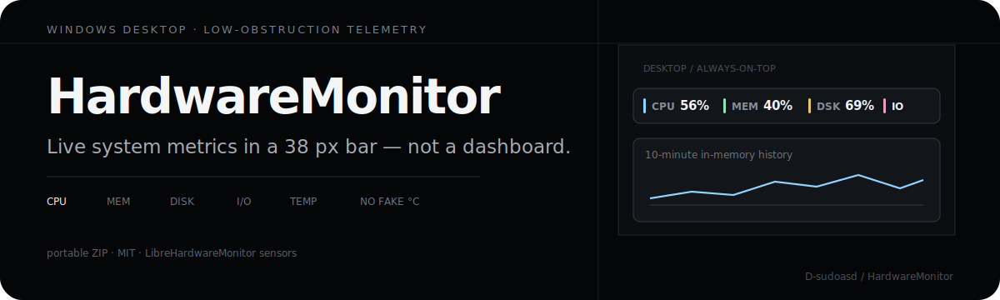
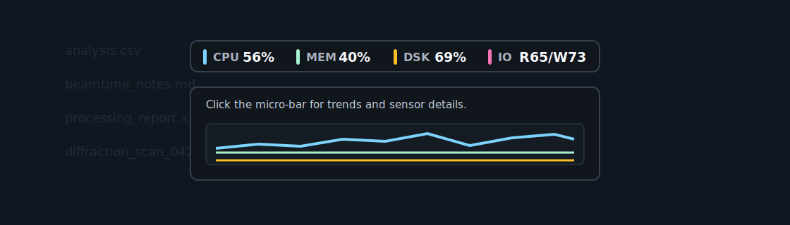

<p align="center">
  
</p>

# HardwareMonitor

**Live system telemetry in a thin Windows bar — not a dashboard that eats your screen.**

Always-on-top micro-bar for CPU, memory, disk usage, disk I/O, and hardware temperature status. Built for people who need live numbers next to documents, terminals, plots, or lab software.

<p align="center">
  
</p>

| Problem | What HardwareMonitor does |
| --- | --- |
| Full dashboards cover the work | Default bar height about **38 px**, always on top |
| One-line glance is enough | CPU · MEM · DSK · IO · temperature on one strip |
| Trends only when needed | Click to expand a compact **10-minute** history |
| Missing sensors lie | Shows **`N/A` / invalid** — never invents temperatures |

<p align="center">
  
</p>

## How it works

1. Collects CPU, memory, and disk metrics with **psutil**.
2. Reads temperature via **LibreHardwareMonitor** through **pythonnet** when available.
3. Draws a draggable micro-bar; click expands details; move away to fold.
4. Rejects unavailable or invalid sensors (including bare `0.0 °C` on some systems).

<p align="center">
  
</p>

## Download

**[Latest Release](https://github.com/D-sudoasd/HardwareMonitor/releases/latest)**

1. Download `HardwareMonitor.zip`.
2. Extract it anywhere.
3. Run `HardwareMonitor.exe`.
4. Allow the administrator prompt if you want the best chance of reading temperature sensors.

CPU, memory, disk, and I/O still work when temperature is unavailable.

## Usage

- **Drag** to reposition · **Left-click** expand/collapse · **Move away** to fold · **Right-click** for menu

## Temperature notes

Readings depend on firmware, controller support, Windows permissions, and LibreHardwareMonitor. If you see `TEMP N/A` or invalid: run as Administrator, compare with LibreHardwareMonitor/HWiNFO, treat missing sensors as environment limits.

## Build from source

Windows · Python 3.11+ · PowerShell

```powershell
python -m venv .venv
.\.venv\Scripts\python -m pip install --upgrade pip
.\.venv\Scripts\python -m pip install -r requirements-dev.txt
.\.venv\Scripts\python main.py
.\scripts\build_exe.ps1
```

Output: `dist\HardwareMonitor\HardwareMonitor.exe`, `dist\HardwareMonitor.zip`, `.sha256`.

## Verify a release ZIP

```powershell
Get-FileHash -Algorithm SHA256 .\HardwareMonitor.zip
Get-Content .\HardwareMonitor.zip.sha256
```

## Development checks

```powershell
.\.venv\Scripts\python -m pytest
```

## License

MIT. Packaged releases include [LibreHardwareMonitor](https://github.com/LibreHardwareMonitor/LibreHardwareMonitor) binaries under their upstream licenses.
