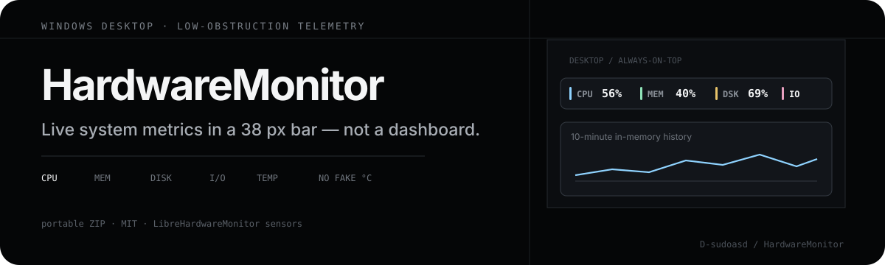
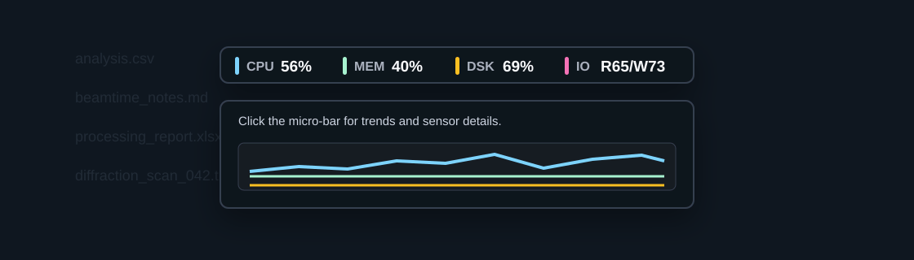

<p align="center">
  
</p>

# HardwareMonitor

**Live system telemetry in a thin Windows bar — not a dashboard that eats your screen.**

Always-on-top micro-bar for CPU, memory, disk usage, disk I/O, and hardware temperature status. Built for people who need live numbers next to documents, terminals, plots, or lab software.

<p align="center">
  
</p>

| Problem | What HardwareMonitor does |
| --- | --- |
| Full dashboards cover the work | Default bar height about **38 px**, always on top |
| One-line glance is enough | CPU · MEM · SYS C: · IO ALL · temperature on one strip |
| Trends only when needed | Click to expand a compact **10-minute** history |
| Missing sensors lie | Shows **`N/A` / invalid** — never invents temperatures |

<p align="center">
  
</p>

## How it works

1. Collects CPU, memory, and disk metrics with **psutil**.
2. Reads temperature via **LibreHardwareMonitor** through **pythonnet** when available.
3. Collects in a background worker so a slow native sensor cannot freeze the bar.
4. Draws a draggable micro-bar; click (or Enter/Space) expands details; move away to fold when auto-collapse is enabled.
5. Rejects unavailable or invalid sensors (including `NaN`, infinity, and bare `0.0 °C` on some systems).

<p align="center">
  
</p>

## Download

**[Latest Release](https://github.com/D-sudoasd/HardwareMonitor/releases/latest)**

1. Download `HardwareMonitor.zip`.
2. Extract it anywhere.
3. Run `HardwareMonitor.exe`.
4. The normal launch does **not** require UAC. If temperature access is unavailable, use **Restart as administrator** from the bar's Menu or tray menu; cancelling UAC leaves the current app running.

CPU, memory, disk, and I/O still work when temperature is unavailable.

## Usage

- **Drag** to reposition · **Left-click** expand/collapse · **Enter/Space** expand/collapse · **Escape** collapse · **Move away** to fold · **Right-click/Menu** for actions
- The tray menu provides **Show**, **Hide**, and **Quit**. If Windows reports no tray, closing the bar exits normally instead of leaving a headless process.
- Position, opacity, auto-collapse, and pin preferences are restored across launches. **Reset position** returns the bar to the current screen's top-right corner.

The expanded view distinguishes the capacity scope (`SYS C:` by default) from aggregate I/O (`IO ALL`, all disks). `Starting…` is shown before the first sample; after a recoverable cycle failure the last good values remain visible with `Update failed — showing last sample` and the diagnostic provider message in the tooltip. Successful recovery replaces that stale tooltip. Very large rates use compact binary units in the bar while the tooltip keeps the complete MB/s values. If a native collector is still blocked during Quit, the bar remains visible as `WAIT` until it returns and can be closed safely.

## Temperature notes

Readings depend on firmware, controller support, Windows permissions, and LibreHardwareMonitor. If you see `TEMP N/A` or invalid, use the explicit **Restart as administrator** action, compare with LibreHardwareMonitor/HWiNFO, and treat missing sensors as environment limits.

## Build from source

Windows · Python 3.11+ · PowerShell

```powershell
python -m venv .venv
.\.venv\Scripts\python -m pip install --upgrade pip
.\.venv\Scripts\python -m pip install -r requirements-dev.txt
.\.venv\Scripts\python main.py
.\scripts\build_exe.ps1
```

Output: `dist\HardwareMonitor\HardwareMonitor.exe`, `dist\HardwareMonitor.zip`, and `dist\HardwareMonitor.zip.sha256`.

To verify the release interpreter choice without installing dependencies or downloading LibreHardwareMonitor, run:

```powershell
.\scripts\build_exe.ps1 -ProbeOnly
```

The probe checks that the interpreter executes and is Python 3.11 or newer, skips a non-working WindowsApps alias, and reports the selected executable/version. In a no-tray environment the visible action is labelled **Quit (no tray available)** because hiding would otherwise leave no recovery path.

## Verify a release ZIP

```powershell
Get-FileHash -Algorithm SHA256 .\dist\HardwareMonitor.zip
Get-Content .\dist\HardwareMonitor.zip.sha256
```

## Development checks

```powershell
.\.venv\Scripts\python -m pytest
```

## License

MIT. Packaged releases include [LibreHardwareMonitor](https://github.com/LibreHardwareMonitor/LibreHardwareMonitor) binaries under their upstream licenses.
